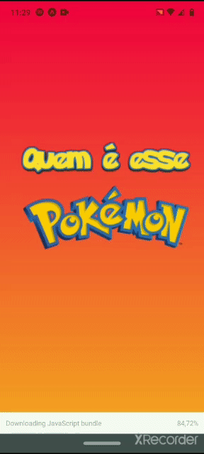

<h1 align="center">
  
  <br/>
  
</h1>

<p align="center">
  <a href="https://github.com/ronnyacacio">
    
  </a>

  <a href="#">
    
  </a>

  <a href="https://github.com/ronnyacacio/who-is-this-pokemon/stargazers">
    
  </a>

  <a href="https://github.com/ronnyacacio/who-is-this-pokemon/commits/master">
    
  </a>

  <a href="#">
    
  </a>

  <a href="https://github.com/ronnyacacio/who-is-this-pokemon/blob/master/LICENSE.md">
    
  </a>
</p>

<br />

## 💻 Projeto

Esse projeto foi feito para treinar a minha habilidade de criação de UI's mobile com React Native, o jogo em modo de quiz de pokemons foi escolhido pela facilidade de se trabalhar com a [PokeApi](https://pokeapi.co), então divirta-se com a nostalgia!

<br />

## 📱 Preview

<h1 align="center">
    
</h1>

## 🚀 Tecnologias

Esse projeto foi desenvolvido com as seguintes tecnologias:

- [React Native](https://facebook.github.io/react-native/)
- [Expo](https://expo.io/)
- [Styled Components](https://styled-components.com/)
- [Axios](https://github.com/axios/axios)
- [Lodash](https://lodash.com/)
- [Expo Av](https://docs.expo.io/versions/latest/sdk/av/) (Para o controle do som na aplicação)

<br />

## 🔥 Instalação

```bash
# Clone este repositório
$ git clone https://github.com/ronnyacacio/who-is-this-pokemon.git

# Entre na pasta who-is-this-pokemon e execunte os comandos:
$ yarn
$ expo start

# Observações:
Voçê deve instalar o app expo no seu celular e escanear o qrcode gerado
```

<p align="center">
  Made with ❤ by <a href="https://www.linkedin.com/in/ronnyacacio/"> Ronny Acácio </a>
</p>
